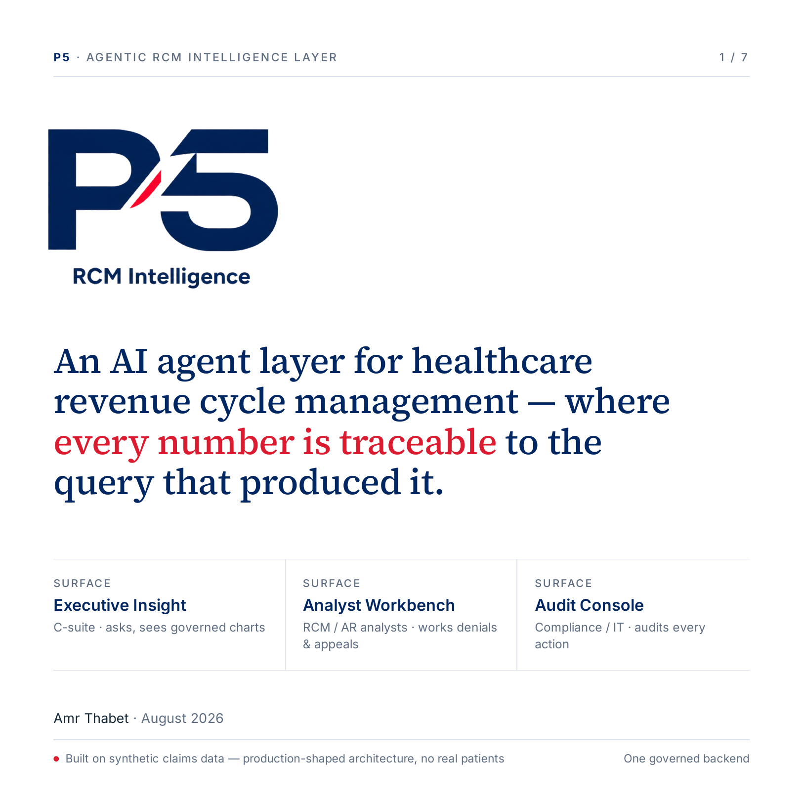
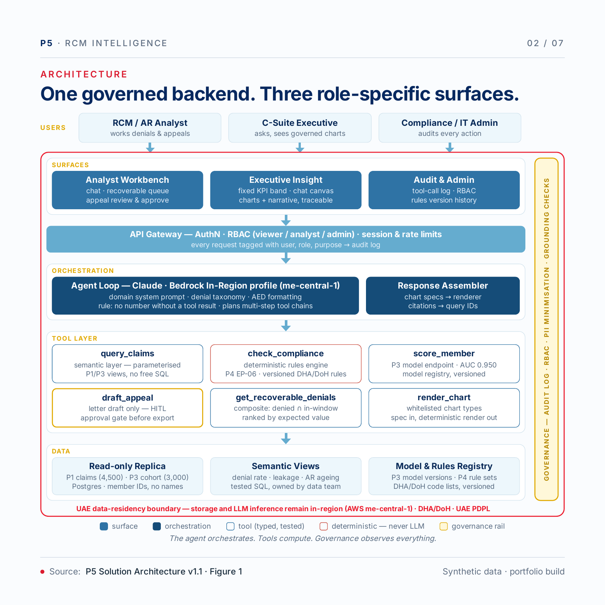

# P5 — Governed Agentic RCM Intelligence

P5 is a portfolio case study for a governed AI product in healthcare revenue cycle management. The current build implements the governed agent backend and configuration-driven data onboarding; the three user-facing product surfaces are designed but not yet implemented.

> Built with synthetic claims data. No real patient data is used, and no financial result is presented as an employer outcome.

[Read the architecture and product summary](docs/P5-System-Summary.pdf)

## The problem

RCM leaders need faster visibility into revenue leakage, while analysts need a defensible way to prioritize recoverable denials. Generative AI can help interpret questions, but financial figures, compliance decisions, and outbound actions need stronger controls than an LLM alone can provide.

P5 separates interpretation from calculation: the language model routes the request, typed tools query governed data, deterministic code handles compliance rules, and a grounding validator blocks unsupported figures.

## Product design

| Surface | Intended user | Purpose | Current status |
|---|---|---|---|
| Executive Insight | Executive/viewer | Aggregate KPIs, governed questions, charts, and source details | Designed; backend aggregate controls partly implemented |
| Analyst Workbench | RCM/AR analyst | Recoverable-denial queue, evidence review, and appeal preparation | Designed; ranking and evidence services implemented |
| Audit Console | Admin/auditor | Inspect actions, parameters, versions, evidence, and access decisions | Designed; persistent audit service and UI not implemented |

[Executive Insight design](assets/executive-insight.png) · [Analyst Workbench design](assets/analyst-workbench.png) · [Audit Console design](assets/audit-console.png)

## What is implemented

- Governed agent loop with six registered, typed tool contracts
- Read-only semantic queries with no free-text SQL
- Deterministic compliance checks and versioned rules
- Recoverable-denial composition and ranking
- Fail-closed numeric grounding
- Code-enforced viewer, analyst, and admin capability boundaries
- Chart specifications bound to existing query results
- Evaluation harness and 55-item golden set
- Configuration-driven onboarding, version stamping, truth regeneration, and rollback for governed extracts

## Product and BA evidence

The case study is supported by a structured product-delivery package:

| Artifact | Scope | Status |
|---|---:|---|
| Business requirements catalogue | 6 business, 26 functional, 16 non-functional, 10 security, and 12 UAT requirements | Draft/pre-baseline |
| Software requirements specification | 50 system functional requirements and 20 system non-functional requirements | Draft/pre-baseline |
| Behaviour and modelling | 9 fully dressed use cases and 9 UML model specifications | Draft; models not yet reviewed |
| UI design inventory | 9 role-based screens | Design evidence only |
| Jira delivery backlog | 10 epics and 52 stories | Created; all issues draft/pre-baseline |
| Process analysis | Five as-is/to-be process narratives and conceptual maps | Draft; formal BPMN 2.0 planned |
| Governance | RACI, glossary/data dictionary, RTM, RAID/decision log, change control, and UAT plan | Draft/pre-baseline |

[View the sanitized Jira backlog](assets/jira-backlog-snapshot.svg)

[Review the BA and product scope](docs/ba-product-scope.md) · [See the delivery evidence register](docs/delivery-evidence.md) · [Read three Jira story samples](docs/jira-story-samples.md) · [Read the public glossary sample](docs/glossary-sample.md)

## Verification evidence

| Evidence | Recorded result | Interpretation |
|---|---:|---|
| Automated test suite | 245 passing | Isolated backend verification run, 20 Aug 2026 |
| Golden-set dry run | 55/55 | Schema, dispatch, and stored-truth validation; no live model calls |
| Full live evaluation | 49/55 automated passes | Three items required human adjudication and three automated checks failed |
| Targeted follow-up | 2 items passed | Did not rerun the complete 55-item set |

These results support the backend case study; they are not UAT acceptance or release approval.

[Read the evaluation summary](evaluations/evaluation-summary.md)

## Roadmap

- **Gen1 — Governed agent foundation:** implemented
- **Gen2 — Configuration-driven portability:** implemented
- **Pre-production product baseline:** designed; application/API, authentication, persistent audit, and complete appeal workflow remain
- **Gen3 — Proactive intelligence:** planned and separately gated

[Read the roadmap](docs/roadmap.md)

## Current limitations

- The product uses synthetic portfolio data only.
- The nine screens are design evidence, not a deployed application.
- Human approval is a defined safety boundary, but the complete appeal approval/export workflow is not implemented.
- Adaptive field inference, anomaly detection, and proactive findings are deferred to Gen3.
- UAT has been planned but not executed or approved.

## Repository guide

| Area | Contents |
|---|---|
| [`docs/`](docs/) | System summary, BA/product scope, evidence register, glossary, and roadmap |
| [`diagrams/`](diagrams/) | Current architecture visual and planned model exports |
| [`assets/`](assets/) | Product design visuals and sanitized Jira backlog snapshot |
| [`evaluations/`](evaluations/) | Verification evidence and limitations |
